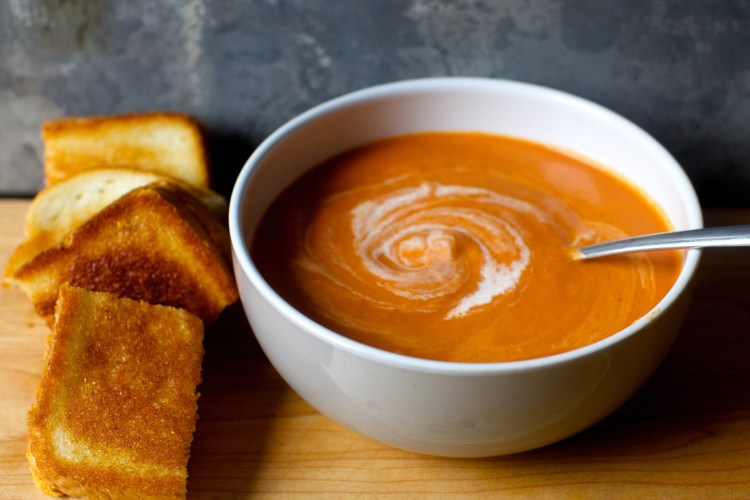

# Cream of tomato soup with grilled cheese

## Ingredients
   - 2 (28-ounce) cans whole tomatoes packed in juice
   - 1 1/2 tablespoons dark brown sugar
   - 4 tablespoons unsalted butter
   - 4 large shallots, minced (about 1/2 cup)
   - 1 tablespoon tomato paste
   - Pinch ground allspice
   - 2 tablespoon all-purpose flour
   - 1 3/4 cups vegetable or chicken stock
   - 1/2 cup heavy cream
   - 2 tablespoons brandy or dry sherry (optional)
   - Salt and cayenne pepper

## Make It!
Heat a heavy 12-inch skillet over low to medium-low heat. Meanwhile, sprinkle a portion of cheese over two bread slices. Top each with a remaining bread slice, pressing down gently to set. Brush sandwich tops completely with half of melted butter; place each sandwich, buttered-size down, in skillet. Brush remaining side of each sandwich completely with remaining butter. Cook until crisp and deep golden brown, 5 to 10 minutes per side, flipping sandwiches back to first side to reheat and crisp, about 15 seconds. Serve immediately.

## Credits
Images and text from [here](https://smittenkitchen.com/2006/11/cream-of-tomato-soup-classic-grilled-cheese/)