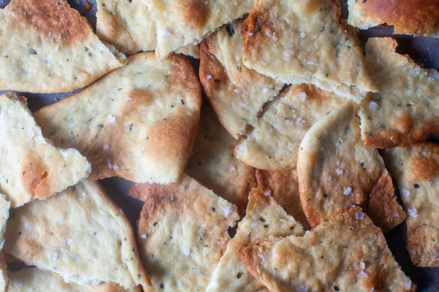

# crisp rosemary flatbread

## Ingredients
  - 1 3/4 cups (230 grams) unbleached all-purpose flour
  - 1 tablespoon chopped rosemary plus 2 (6-inch) sprigs (optional)
  - 1 teaspoon baking powder
  - 3/4 teaspoon kosher salt
  - 1/2 cup (120 ml) water
  - 1/3 cup (80 ml) olive oil plus more for brushing
  - Flaky sea salt such as Maldon

## Make It!
Heat oven to 450°F. Lightly coat a large baking sheet with olive oil.

Stir together flour, chopped rosemary, baking powder, and salt in a large, wide bowl.

Make a well in center, then add water and oil and gradually stir into flour with a wooden spoon

until a dough forms. Use your hands to gently knead dough inside the bowl 4 or 5 times, until it comes together in a 

semi-smooth ball.

Divide dough into 3 large or 6 smaller pieces and roll out one piece at a time on an unfloured counter, to about 10-inch (for 

larger pieces of dough) or 7-inch rounds (smaller pieces) — shape can be rustic; dough should be thin. Lift flatbread onto 

prepared baking sheet. Repeat with remaining pieces of dough. I can sometimes squeeze 6 small flatbreads on a half-sheet pan; 

sometimes I need to bake 1 to 2 in a second batch.

Lightly brush tops with additional oil and scatter small clusters of rosemary leaves on top (if using), pressing in slightly. 

Sprinkle with sea salt. Bake until pale golden and browned in spots, 8 to 10 minutes, rotating flatbreads if needed on the pan 

for even color. Let cool then break into pieces.

Do ahead: Flatbread can be made up to 4 days ahead and cooled completely, then kept in an airtight container at room 

temperature.

## Credits
Text and Images from [here](https://smittenkitchen.com/2008/08/crisp-rosemary-flatbread/)
