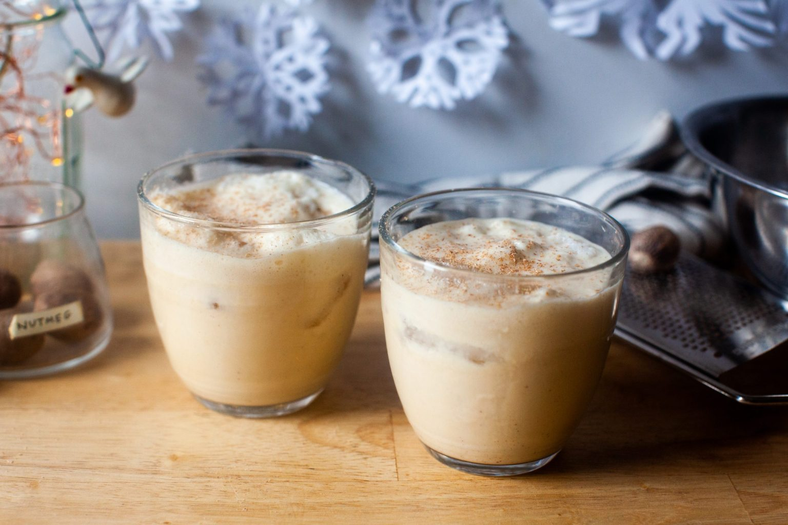

# Small Batch Eggnog

## Ingredients
  - 1 large egg, ideally pasteurized
  - 1 tablespoon plus 1 teaspoon granulated sugar
  - 6 tablespoons rum, brandy, whiskey, or a combination thereof
  - 1/4 teaspoon vanilla (optional)
  - 1/8 teaspoon ground cinnamon (optional)
  - 4 to 6 tablespoons milk
  - 4 to 6 tablespoons heavy cream
  - Freshly grated nutmeg

## Make It!
Separate your egg, placing the yolk in one bowl or jar and the white in another.

Add 1 teaspoon of the sugar to the egg white and whisk it by hand for about 3 mi

nutes, until very thick but not quite holding soft peaks. You can also do this 

with an electric hand mixer. Set aside.

Add 1 tablespoon of the sugar to the yolk and use the same whisk to beat for a

full minute, until slightly thickened and more pale in color. Whisk in the fi

rst tablespoon of rum, brandy, or whiskey, making sure it’s fully combined be

fore adding the rest. Add vanilla and cinnamon if using, then the lower amoun

t (4 tablespoons or 1/4 cup each) of milk and cream. Taste and add some or al

l of the remaining cream and milk if you wish, or more sugar.

Pour the yolk mixture into the whites and stir a few times, 

not fully combining the two mixtures.

Place a couple ice cubes in 8-ounce glasses and pour eggnog

over. Grate fresh nutmeg on top. Any extra eggnog, unlikely

as it will be, keeps in the fridge for a few days.

Cooked eggnog: In a small saucepan, whisk egg yolk
 with 1 tablespoon sugar until very smooth. Gradually, slowly,

whisk in milk. Place saucepan on stove over medium heat and

cook, stirring the whole time, until the the mixture reaches

160°F on a thermometer. Remove from heat, whisk in cream, vanilla,

and cinnamon (if using) and let mixture chill completely. Once cold, whisk in brandy,

rum, or whisky. Cooked eggnog will be thicker than uncooked eggnog.

## Credits
Text and Images from [here](https://smittenkitchen.com/2020/12/small-batch-eggnog/)
