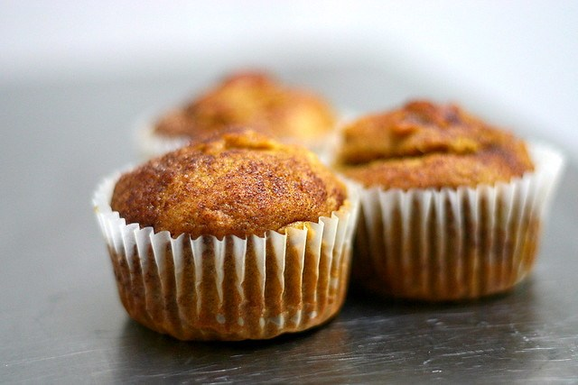

# Pumpkin Muffins

## Ingredients
  - 1 1/2 cups all-purpose flour
  - 1 teaspoon baking powder
  - 1/2 teaspoon baking soda
  - 1/2 teaspoon table salt
  - 1 teaspoon pumpkin-pie spice (or 1/2 teaspoon cinnamon + 1/4 teaspoon fresh nutmeg + 1/4 teaspoon ginger + pinch of ground cloves and allspice)
  - 1 cup (original recipe) to 1 1/3 cup
  - 1/3 cup vegetable or another neutral cooking oil
  - 2 large eggs
  - 1 1/4 cups plus 1 tablespoon granulated sugar
  - 1 teaspoon cinnamon

## Make It!
Heat oven to 350 degrees. Put liners in 12 standard-sized muffin cups.

Stir or whisk together flour, baking powder, baking soda, salt and spice in small/medium bowl.

In a larger bowl, whisk together pumpkin, oil, eggs and 1 1/4 cups sugar.

Add dry ingredients to wet and stir until just combined. Divide batter among 

muffin cups (each about 3/4 full).

Stir together last tablespoon of sugar and teaspoon of cinnamon. Sprinkle over each muffin.

Bake until puffed and golden brown and wooden pick or skewer inserted into the center of a muffin comes out clean, 25 to 30 minutes.

Cool in pan on a rack five minutes, then transfer muffins from pan to rack and cool to warm or room temperature.

## Do ahead

Most muffins don’t keep well, but these are excellent on Day 2 (after being stored in an airtight container at room temperature) and not bad at all on 

Day 3. If longer, I’d keep them in the freezer until needed.

## Credits
Text and Images from [here](https://smittenkitchen.com/2006/10/promise-keeper-pumpkin-eater/)